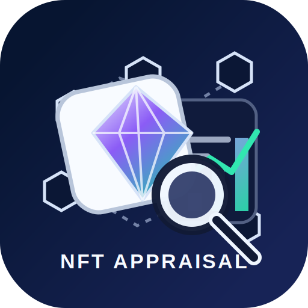

<p align="center">
  
</p>

# Pharos NFT Appraisal

A Pharos-compatible skill for appraising NFT collections on Ethereum and Base. It extracts an NFT contract address and chain from a user prompt, fetches collection metadata from Alchemy, and returns a cautious, source-grounded appraisal.

This skill is built for the Skill-to-Agent Dual Cascade Hackathon as a reusable module that any agent can call.

## Features

- Extracts NFT contract address from natural-language prompts
- Supports Ethereum mainnet and Base mainnet
- Uses OpenAI for structured extraction when available
- Falls back to regex address extraction and chain keyword detection
- Fetches NFT collection metadata from Alchemy
- Returns floor price when Alchemy/OpenSea metadata provides it
- Produces risk flags, limitations, citations, and a non-financial appraisal summary

## Requirements

- Python 3.10+
- `ALCHEMY_API_KEY`

Optional:

- `OPENAI_API_KEY`
- `OPENAI_EXTRACT_MODEL`

No third-party Python package is required; the skill uses Python standard-library HTTP utilities.

## Quick Start

```bash
export ALCHEMY_API_KEY="your_alchemy_key"
python3 scripts/run_appraisal.py --metadata examples/nft-appraisal-input.json --pretty
```

Or pipe JSON through stdin:

```bash
printf '%s\n' '{"prompt":"tell me about 0xed5af388653567af2f388e6224dc7c4b3241c544, which is on eth"}' \
  | python3 scripts/run_appraisal.py --pretty
```

## Input

Natural-language prompt:

```json
{
  "prompt": "tell me about 0xed5af388653567af2f388e6224dc7c4b3241c544, which is on eth"
}
```

Explicit target:

```json
{
  "contract_address": "0xed5af388653567af2f388e6224dc7c4b3241c544",
  "chain": "eth"
}
```

Optional API-key metadata is supported, though environment variables are preferred:

```json
{
  "prompt": "Appraise this Base NFT collection: 0x0000000000000000000000000000000000000000",
  "alchemy_api_key": "optional",
  "openai_api_key": "optional"
}
```

Supported chain values:

- `eth`
- `ethereum`
- `mainnet`
- `base`

All values normalize to `eth` or `base`.

## Output

The skill returns JSON containing:

- extracted `target`
- extraction method
- Alchemy collection metadata
- OpenSea metadata when available
- floor price when available
- cautious appraisal summary
- confidence level
- risk flags
- limitations
- provider citation

Example shape:

```json
{
  "status": "success",
  "skill": "nft_appraisal_skill",
  "source": "alchemy",
  "target": {
    "chain": "eth",
    "network": "eth-mainnet",
    "contract_address": "0xed5af388653567af2f388e6224dc7c4b3241c544"
  },
  "collection": {
    "name": "Collection name",
    "symbol": "SYMBOL",
    "token_type": "ERC721",
    "opensea": {
      "floor_price": 1.23
    }
  },
  "appraisal": {
    "summary": "Source-grounded, non-financial appraisal.",
    "confidence": "medium",
    "risk_flags": [],
    "limitations": []
  }
}
```

## Error Behavior

Common errors:

- `MISSING_API_KEY`
- `MISSING_CONTRACT_ADDRESS`
- `NEEDS_CHAIN`
- `INVALID_CONTRACT_ADDRESS`
- `UNSUPPORTED_CHAIN`
- `ALCHEMY_AUTH_FAILED`
- `PROVIDER_ERROR`
- `NOT_FOUND`

If a prompt contains an address but no chain, the skill returns `NEEDS_CHAIN` instead of guessing.

## Safety Notes

This skill does not provide buy, sell, hold, price-target, profit, or investment advice. It does not invent sales, volume, ownership, rarity, or floor data. Appraisal claims are limited to metadata returned by Alchemy.

Unsupported chains are rejected. API keys are never included in output.

## Skill Files

- `SKILL.md` - Pharos skill manifest and agent instructions
- `scripts/nft_appraisal_skill.py` - reusable `run(metadata)` implementation
- `scripts/run_appraisal.py` - CLI wrapper
- `references/io-schema.md` - detailed input/output schema
- `examples/nft-appraisal-input.json` - sample request
